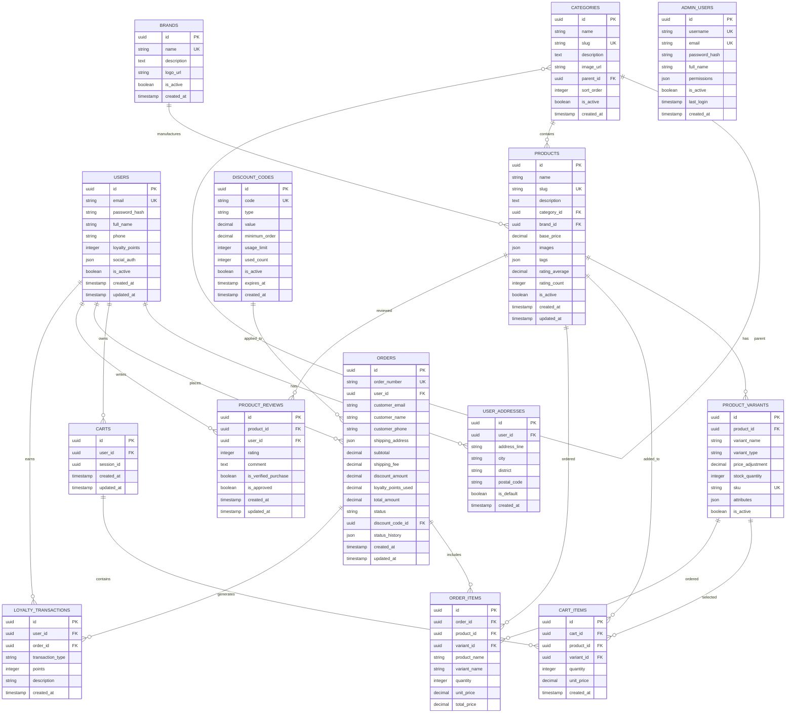

# DATABASE DESIGN - COFFEE & TEA E-COMMERCE

## 1. Entity Relationship Diagram (ERD)



## 2. Database Schema Definitions

### 2.1. Users Table
```sql
CREATE TABLE users (
    id UUID PRIMARY KEY DEFAULT uuid_generate_v4(),
    email VARCHAR(255) UNIQUE NOT NULL,
    password_hash VARCHAR(255),
    full_name VARCHAR(255) NOT NULL,
    phone VARCHAR(20),
    loyalty_points INTEGER DEFAULT 0,
    social_auth JSONB,
    is_active BOOLEAN DEFAULT true,
    created_at TIMESTAMP DEFAULT CURRENT_TIMESTAMP,
    updated_at TIMESTAMP DEFAULT CURRENT_TIMESTAMP
);

-- Indexes
CREATE INDEX idx_users_email ON users(email);
CREATE INDEX idx_users_active ON users(is_active);
```

### 2.2. User Addresses Table
```sql
CREATE TABLE user_addresses (
    id UUID PRIMARY KEY DEFAULT uuid_generate_v4(),
    user_id UUID REFERENCES users(id) ON DELETE CASCADE,
    address_line VARCHAR(500) NOT NULL,
    city VARCHAR(100) NOT NULL,
    district VARCHAR(100) NOT NULL,
    postal_code VARCHAR(20),
    is_default BOOLEAN DEFAULT false,
    created_at TIMESTAMP DEFAULT CURRENT_TIMESTAMP
);

-- Indexes
CREATE INDEX idx_user_addresses_user_id ON user_addresses(user_id);
CREATE INDEX idx_user_addresses_default ON user_addresses(user_id, is_default);
```

### 2.3. Categories Table
```sql
CREATE TABLE categories (
    id UUID PRIMARY KEY DEFAULT uuid_generate_v4(),
    name VARCHAR(255) NOT NULL,
    slug VARCHAR(255) UNIQUE NOT NULL,
    description TEXT,
    image_url VARCHAR(500),
    parent_id UUID REFERENCES categories(id),
    sort_order INTEGER DEFAULT 0,
    is_active BOOLEAN DEFAULT true,
    created_at TIMESTAMP DEFAULT CURRENT_TIMESTAMP
);

-- Indexes
CREATE INDEX idx_categories_slug ON categories(slug);
CREATE INDEX idx_categories_parent ON categories(parent_id);
CREATE INDEX idx_categories_active ON categories(is_active);
```

### 2.4. Products Table
```sql
CREATE TABLE products (
    id UUID PRIMARY KEY DEFAULT uuid_generate_v4(),
    name VARCHAR(255) NOT NULL,
    slug VARCHAR(255) UNIQUE NOT NULL,
    description TEXT NOT NULL,
    category_id UUID REFERENCES categories(id),
    brand_id UUID REFERENCES brands(id),
    base_price DECIMAL(10,2) NOT NULL,
    images JSONB NOT NULL,
    tags JSONB,
    rating_average DECIMAL(3,2) DEFAULT 0,
    rating_count INTEGER DEFAULT 0,
    is_active BOOLEAN DEFAULT true,
    created_at TIMESTAMP DEFAULT CURRENT_TIMESTAMP,
    updated_at TIMESTAMP DEFAULT CURRENT_TIMESTAMP
);

-- Indexes
CREATE INDEX idx_products_slug ON products(slug);
CREATE INDEX idx_products_category ON products(category_id);
CREATE INDEX idx_products_brand ON products(brand_id);
CREATE INDEX idx_products_active ON products(is_active);
CREATE INDEX idx_products_rating ON products(rating_average DESC);
CREATE INDEX idx_products_price ON products(base_price);
```

### 2.5. Product Variants Table
```sql
CREATE TABLE product_variants (
    id UUID PRIMARY KEY DEFAULT uuid_generate_v4(),
    product_id UUID REFERENCES products(id) ON DELETE CASCADE,
    variant_name VARCHAR(255) NOT NULL,
    variant_type VARCHAR(100) NOT NULL, -- size, preparation, sweetness, etc.
    price_adjustment DECIMAL(10,2) DEFAULT 0,
    stock_quantity INTEGER NOT NULL DEFAULT 0,
    sku VARCHAR(100) UNIQUE NOT NULL,
    attributes JSONB,
    is_active BOOLEAN DEFAULT true
);

-- Indexes
CREATE INDEX idx_variants_product ON product_variants(product_id);
CREATE INDEX idx_variants_sku ON product_variants(sku);
CREATE INDEX idx_variants_stock ON product_variants(stock_quantity);
```

### 2.6. Orders Table
```sql
CREATE TABLE orders (
    id UUID PRIMARY KEY DEFAULT uuid_generate_v4(),
    order_number VARCHAR(50) UNIQUE NOT NULL,
    user_id UUID REFERENCES users(id),
    customer_email VARCHAR(255) NOT NULL,
    customer_name VARCHAR(255) NOT NULL,
    customer_phone VARCHAR(20),
    shipping_address JSONB NOT NULL,
    subtotal DECIMAL(10,2) NOT NULL,
    shipping_fee DECIMAL(10,2) DEFAULT 0,
    discount_amount DECIMAL(10,2) DEFAULT 0,
    loyalty_points_used INTEGER DEFAULT 0,
    total_amount DECIMAL(10,2) NOT NULL,
    status VARCHAR(50) DEFAULT 'pending',
    discount_code_id UUID REFERENCES discount_codes(id),
    status_history JSONB,
    created_at TIMESTAMP DEFAULT CURRENT_TIMESTAMP,
    updated_at TIMESTAMP DEFAULT CURRENT_TIMESTAMP
);

-- Indexes
CREATE INDEX idx_orders_number ON orders(order_number);
CREATE INDEX idx_orders_user ON orders(user_id);
CREATE INDEX idx_orders_email ON orders(customer_email);
CREATE INDEX idx_orders_status ON orders(status);
CREATE INDEX idx_orders_date ON orders(created_at DESC);
```

## 3. Sample Data Structure

### 3.1. Product Categories Sample
```json
{
  "categories": [
    {
      "name": "Coffee & Espresso",
      "slug": "coffee-espresso",
      "subcategories": [
        {"name": "Coffee Beans", "slug": "coffee-beans"},
        {"name": "Ground Coffee", "slug": "ground-coffee"},
        {"name": "Cold Brew", "slug": "cold-brew"},
        {"name": "Espresso Shots", "slug": "espresso-shots"}
      ]
    },
    {
      "name": "Tea & Beverages", 
      "slug": "tea-beverages",
      "subcategories": [
        {"name": "Traditional Tea", "slug": "traditional-tea"},
        {"name": "Milk Tea", "slug": "milk-tea"},
        {"name": "Fresh Juice", "slug": "fresh-juice"},
        {"name": "Smoothies", "slug": "smoothies"}
      ]
    },
    {
      "name": "Food & Snacks",
      "slug": "food-snacks", 
      "subcategories": [
        {"name": "Sweet Pastries", "slug": "sweet-pastries"},
        {"name": "Savory Pastries", "slug": "savory-pastries"},
        {"name": "Fast Food", "slug": "fast-food"}
      ]
    }
  ]
}
```

### 3.2. Product Variants Sample
```json
{
  "product": {
    "name": "Vietnamese Drip Coffee",
    "variants": [
      {
        "variant_type": "size",
        "options": [
          {"name": "Small", "price_adjustment": 0},
          {"name": "Medium", "price_adjustment": 5000},
          {"name": "Large", "price_adjustment": 10000}
        ]
      },
      {
        "variant_type": "preparation",
        "options": [
          {"name": "Hot", "price_adjustment": 0},
          {"name": "Iced", "price_adjustment": 0}
        ]
      },
      {
        "variant_type": "sweetness",
        "options": [
          {"name": "No Sugar", "price_adjustment": 0},
          {"name": "Low Sugar", "price_adjustment": 0},
          {"name": "Regular", "price_adjustment": 0},
          {"name": "Extra Sweet", "price_adjustment": 0}
        ]
      },
      {
        "variant_type": "milk",
        "options": [
          {"name": "Black", "price_adjustment": 0},
          {"name": "Condensed Milk", "price_adjustment": 2000},
          {"name": "Fresh Milk", "price_adjustment": 3000},
          {"name": "Oat Milk", "price_adjustment": 5000}
        ]
      }
    ]
  }
}
```

### 3.3. Order Status History Sample
```json
{
  "status_history": [
    {
      "status": "pending",
      "timestamp": "2024-12-27T10:00:00Z",
      "note": "Order received"
    },
    {
      "status": "confirmed", 
      "timestamp": "2024-12-27T10:15:00Z",
      "note": "Payment confirmed"
    },
    {
      "status": "preparing",
      "timestamp": "2024-12-27T10:30:00Z", 
      "note": "Order is being prepared"
    },
    {
      "status": "shipping",
      "timestamp": "2024-12-27T11:00:00Z",
      "note": "Order out for delivery"
    },
    {
      "status": "delivered",
      "timestamp": "2024-12-27T12:30:00Z",
      "note": "Order delivered successfully"
    }
  ]
}
```

## 4. Database Indexes for Performance

### 4.1. Search Optimization
```sql
-- Full-text search indexes
CREATE INDEX idx_products_search ON products 
USING gin(to_tsvector('english', name || ' ' || description));

-- Price range queries
CREATE INDEX idx_products_price_range ON products(base_price) 
WHERE is_active = true;

-- Category filtering
CREATE INDEX idx_products_category_active ON products(category_id, is_active);
```

### 4.2. Analytics Queries
```sql
-- Daily sales reports
CREATE INDEX idx_orders_daily_sales ON orders(DATE(created_at), status);

-- Revenue tracking
CREATE INDEX idx_orders_revenue ON orders(created_at, total_amount) 
WHERE status = 'completed';

-- Product popularity
CREATE INDEX idx_order_items_popularity ON order_items(product_id, created_at);
```

## 5. Database Constraints

### 5.1. Business Rules Constraints
```sql
-- Ensure positive prices
ALTER TABLE products ADD CONSTRAINT chk_positive_price 
CHECK (base_price > 0);

-- Ensure positive stock
ALTER TABLE product_variants ADD CONSTRAINT chk_positive_stock 
CHECK (stock_quantity >= 0);

-- Ensure valid ratings
ALTER TABLE product_reviews ADD CONSTRAINT chk_valid_rating 
CHECK (rating >= 1 AND rating <= 5);

-- Ensure positive loyalty points
ALTER TABLE users ADD CONSTRAINT chk_positive_points 
CHECK (loyalty_points >= 0);

-- Order status validation
ALTER TABLE orders ADD CONSTRAINT chk_valid_status 
CHECK (status IN ('pending', 'confirmed', 'preparing', 'shipping', 'delivered', 'cancelled'));
```

### 5.2. Data Integrity Triggers
```sql
-- Update product rating when review is added
CREATE OR REPLACE FUNCTION update_product_rating()
RETURNS TRIGGER AS $$
BEGIN
    UPDATE products 
    SET rating_average = (
        SELECT AVG(rating)::DECIMAL(3,2) 
        FROM product_reviews 
        WHERE product_id = NEW.product_id AND is_approved = true
    ),
    rating_count = (
        SELECT COUNT(*) 
        FROM product_reviews 
        WHERE product_id = NEW.product_id AND is_approved = true
    )
    WHERE id = NEW.product_id;
    
    RETURN NEW;
END;
$$ LANGUAGE plpgsql;

CREATE TRIGGER tr_update_product_rating
    AFTER INSERT OR UPDATE ON product_reviews
    FOR EACH ROW
    EXECUTE FUNCTION update_product_rating();
```

## 6. Database Performance Optimization

### 6.1. Partitioning Strategy
```sql
-- Partition orders by month for better performance
CREATE TABLE orders_2024 PARTITION OF orders
FOR VALUES FROM ('2024-01-01') TO ('2025-01-01');

-- Partition loyalty transactions by year
CREATE TABLE loyalty_transactions_2024 PARTITION OF loyalty_transactions
FOR VALUES FROM ('2024-01-01') TO ('2025-01-01');
```

### 6.2. Caching Strategy
```javascript
// Redis caching for frequently accessed data
const cacheKeys = {
  featuredProducts: 'featured:products',
  categories: 'categories:all',
  popularProducts: 'popular:products',
  userCart: (userId) => `cart:${userId}`,
  productDetails: (productId) => `product:${productId}`
};

// Cache TTL settings
const cacheTTL = {
  featuredProducts: 3600, // 1 hour
  categories: 86400,      // 24 hours
  popularProducts: 1800,  // 30 minutes
  userCart: 3600,         // 1 hour
  productDetails: 7200    // 2 hours
};
```

## 7. Backup and Migration Strategy

### 7.1. Backup Scripts
```bash
#!/bin/bash
# Daily backup script
pg_dump -h localhost -U coffee_user coffee_tea_db > backup_$(date +%Y%m%d).sql

# Weekly backup with compression
pg_dump -h localhost -U coffee_user coffee_tea_db | gzip > backup_$(date +%Y%m%d).sql.gz
```

### 7.2. Migration Scripts
```sql
-- Migration for adding new fields
ALTER TABLE products ADD COLUMN IF NOT EXISTS featured BOOLEAN DEFAULT false;
ALTER TABLE products ADD COLUMN IF NOT EXISTS featured_until TIMESTAMP;

-- Create index for featured products
CREATE INDEX IF NOT EXISTS idx_products_featured 
ON products(featured, featured_until) 
WHERE featured = true;
```

Thiết kế database này đảm bảo:
- **Scalability**: Có thể handle lượng data lớn
- **Performance**: Indexes và caching tối ưu
- **Integrity**: Constraints và triggers đảm bảo data quality
- **Flexibility**: Hỗ trợ các variants phức tạp và extensible
- **Analytics**: Hỗ trợ reports và dashboard requirements
