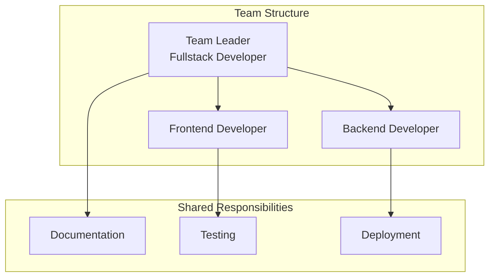
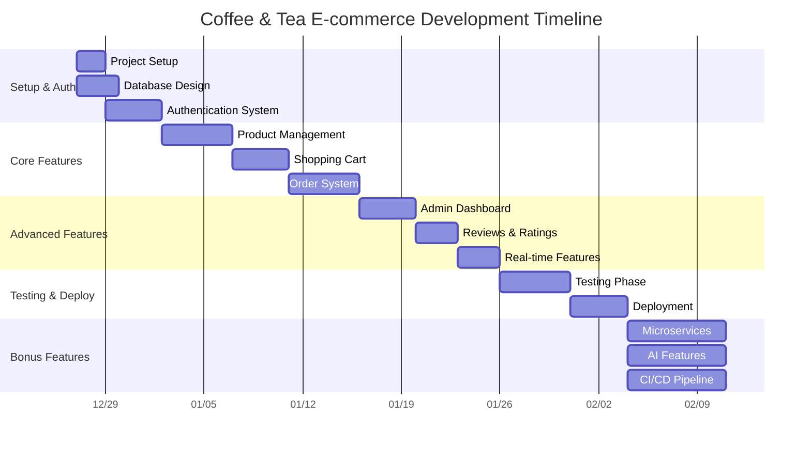

# PHÂN CÔNG CÔNG VIỆC VÀ TIMELINE - COFFEE & TEA E-COMMERCE

## 1. Cơ Cấu Team và Phân Công Trách Nhiệm

### 1.1. Cơ Cấu Team (2-3 thành viên)


### 1.2. Chi Tiết Phân Công Theo Thành Viên

#### **Thành viên A - Team Leader & Backend Developer**
**Chính:**
- Authentication & Authorization System
- User Management APIs
- Order Management System
- Admin Dashboard Backend
- Database Design & Migration
- API Documentation
- Deployment & DevOps

**Phụ:**
- Code Review và Quality Assurance
- Project Management
- Technical Documentation

#### **Thành viên B - Frontend Developer**
**Chính:**
- Landing Page & Product Catalog UI
- Shopping Cart & Checkout Flow
- User Profile & Order History
- Real-time UI Updates
- Responsive Design
- PWA Implementation

**Phụ:**
- Frontend Testing (Unit & Integration)
- UI/UX Optimization
- Performance Optimization

#### **Thành viên C - Backend Developer (nếu có 3 người)**
**Chính:**
- Product Management APIs
- Search & Filtering System
- Payment Integration
- Notification Service
- Real-time WebSocket Features
- ElasticSearch Integration

**Phụ:**
- API Testing
- Database Optimization
- Security Implementation

### 1.3. Phân Công Theo Chức Năng Chi Tiết

#### **PHASE 1: Core Features (Tuần 1-3)**

##### **Week 1: Project Setup & Authentication**
**Thành viên A (Backend Lead):**
- [ ] Setup project structure và repository
- [ ] Database design và migration scripts
- [ ] Authentication API (register, login, social auth)
- [ ] Password recovery system
- [ ] JWT token management
- [ ] Basic error handling middleware

**Thành viên B (Frontend):**
- [ ] Setup React/Vue project với Vite
- [ ] UI component library setup (Tailwind)
- [ ] Authentication pages (login, register)
- [ ] Social login integration (Google/Facebook)
- [ ] Form validation
- [ ] Responsive layout base

**Thành viên C (Backend):**
- [ ] User profile APIs
- [ ] Address management APIs
- [ ] Email service integration
- [ ] Input validation schemas
- [ ] API rate limiting
- [ ] Basic logging setup

##### **Week 2: Product Management**
**Thành viên A:**
- [ ] Product CRUD APIs
- [ ] Category management APIs
- [ ] Product variant system
- [ ] Image upload functionality
- [ ] Admin product management APIs
- [ ] Inventory management

**Thành viên B:**
- [ ] Product catalog page
- [ ] Product detail page
- [ ] Product search UI
- [ ] Filter & sorting components
- [ ] Pagination component
- [ ] Image gallery component

**Thành viên C:**
- [ ] Search & filtering backend logic
- [ ] ElasticSearch setup (bonus)
- [ ] Product recommendation engine
- [ ] Brand management APIs
- [ ] Product review system APIs
- [ ] Rating aggregation system

##### **Week 3: Shopping Cart & Orders**
**Thành viên A:**
- [ ] Shopping cart APIs
- [ ] Order creation system
- [ ] Order status management
- [ ] Admin order management
- [ ] Discount code system
- [ ] Loyalty points system

**Thành viên B:**
- [ ] Shopping cart UI
- [ ] Checkout flow (multi-step)
- [ ] Order confirmation page
- [ ] Order history page
- [ ] Order tracking UI
- [ ] Real-time cart updates

**Thành viên C:**
- [ ] Payment integration setup
- [ ] WebSocket server for real-time features
- [ ] Email notification system
- [ ] Order status tracking
- [ ] Guest checkout functionality
- [ ] Inventory reduction logic

#### **PHASE 2: Advanced Features (Tuần 4-5)**

##### **Week 4: Admin Dashboard & Analytics**
**Thành viên A:**
- [ ] Simple dashboard APIs
- [ ] Advanced dashboard with analytics
- [ ] User management APIs
- [ ] Order management APIs
- [ ] Discount management APIs
- [ ] Report generation

**Thành viên B:**
- [ ] Admin dashboard UI
- [ ] Analytics charts integration
- [ ] User management interface
- [ ] Order management interface
- [ ] Discount code management UI
- [ ] Report visualization

**Thành viên C:**
- [ ] Analytics data processing
- [ ] Dashboard real-time updates
- [ ] Export functionality
- [ ] Advanced filtering systems
- [ ] Data aggregation services
- [ ] Performance monitoring

##### **Week 5: Reviews, Ratings & Real-time Features**
**Thành viên A:**
- [ ] Product review APIs
- [ ] Rating system implementation
- [ ] Review moderation system
- [ ] Real-time notification system
- [ ] WebSocket event handling
- [ ] Comment system APIs

**Thành viên B:**
- [ ] Product review UI
- [ ] Star rating components
- [ ] Real-time comment updates
- [ ] Notification system UI
- [ ] Review moderation interface
- [ ] Interactive rating displays

**Thành viên C:**
- [ ] WebSocket real-time features
- [ ] Comment approval workflow
- [ ] Rating calculation engine
- [ ] Sentiment analysis (bonus)
- [ ] Review spam detection
- [ ] Real-time inventory updates

#### **PHASE 3: Testing & Deployment (Tuần 6-7)**

##### **Week 6: Testing & Bug Fixes**
**Tất cả thành viên:**
- [ ] Unit testing cho components/functions
- [ ] Integration testing cho APIs
- [ ] End-to-end testing scenarios
- [ ] Security testing
- [ ] Performance testing
- [ ] Bug fixes và optimization

**Thành viên A (Focus):**
- [ ] API testing với Postman/Jest
- [ ] Database performance optimization
- [ ] Security vulnerability testing
- [ ] Load testing

**Thành viên B (Focus):**
- [ ] Frontend unit testing
- [ ] Cross-browser testing
- [ ] Mobile responsiveness testing
- [ ] UI/UX refinement

**Thành viên C (Focus):**
- [ ] Integration testing
- [ ] WebSocket testing
- [ ] Email delivery testing
- [ ] Payment flow testing

##### **Week 7: Deployment & Documentation**
**Thành viên A:**
- [ ] Docker containerization
- [ ] Production environment setup
- [ ] CI/CD pipeline configuration
- [ ] SSL certificate setup
- [ ] Domain configuration
- [ ] Monitoring setup

**Thành viên B:**
- [ ] Frontend build optimization
- [ ] SEO optimization
- [ ] PWA configuration
- [ ] Performance monitoring setup
- [ ] User documentation
- [ ] Admin user guide

**Thành viên C:**
- [ ] Database backup strategy
- [ ] Security hardening
- [ ] API documentation finalization
- [ ] Error monitoring setup
- [ ] Log aggregation setup
- [ ] Health check endpoints

#### **PHASE 4: Bonus Features (Tuần 8)**

##### **Week 8: Bonus Implementation (nếu có thời gian)**
**Microservices (Thành viên A + C):**
- [ ] Service decomposition
- [ ] API Gateway setup
- [ ] RabbitMQ integration
- [ ] Service communication

**AI Features (Thành viên C):**
- [ ] Chatbot integration
- [ ] Product recommendation AI
- [ ] Image search functionality
- [ ] Sentiment analysis

**CI/CD Enhancement (Thành viên A):**
- [ ] Advanced GitHub Actions
- [ ] Automated testing pipeline
- [ ] Blue-green deployment
- [ ] Rollback mechanisms

**ElasticSearch (Thành viên B + C):**
- [ ] Advanced search features
- [ ] Search analytics
- [ ] Auto-complete functionality
- [ ] Search result optimization

## 2. Timeline Chi Tiết

### 2.1. Gantt Chart


### 2.2. Daily Standup Structure
**Thời gian:** 9:00 AM hàng ngày (15 phút)

**Format:**
1. **Yesterday:** Công việc đã hoàn thành
2. **Today:** Kế hoạch công việc hôm nay
3. **Blockers:** Vấn đề cần hỗ trợ

**Ví dụ:**
```
Member A (Backend Lead):
- Yesterday: Completed authentication APIs, JWT implementation
- Today: Work on product CRUD APIs, setup ElasticSearch
- Blockers: Need clarification on product variant structure

Member B (Frontend):
- Yesterday: Setup React project, created login/register pages
- Today: Build product catalog page, implement pagination
- Blockers: Waiting for product APIs to be ready

Member C (Backend):
- Yesterday: Setup email service, implemented rate limiting
- Today: Work on search & filtering logic
- Blockers: ElasticSearch connection issues
```

### 2.3. Weekly Sprint Reviews
**Thời gian:** Thứ 6 hàng tuần (1 giờ)

**Agenda:**
1. **Demo:** Showcase completed features
2. **Review:** Code review và feedback
3. **Planning:** Kế hoạch tuần tiếp theo
4. **Retrospective:** Lessons learned

## 3. Quản Lý Mã Nguồn

### 3.1. Git Workflow Strategy
```mermaid
gitgraph
    commit id: "Initial"
    branch develop
    checkout develop
    commit id: "Setup"
    
    branch feature/auth
    checkout feature/auth
    commit id: "Auth APIs"
    commit id: "JWT Implementation"
    
    checkout develop
    merge feature/auth
    
    branch feature/products
    checkout feature/products
    commit id: "Product CRUD"
    commit id: "Search & Filter"
    
    checkout develop
    merge feature/products
    
    checkout main
    merge develop
    commit id: "Release v1.0"
```

### 3.2. Branch Naming Convention
- **main**: Production code
- **develop**: Integration branch
- **feature/[feature-name]**: New features
- **hotfix/[issue-name]**: Critical fixes
- **release/[version]**: Release preparation

**Examples:**
- `feature/user-authentication`
- `feature/product-management`
- `feature/shopping-cart`
- `hotfix/login-bug`
- `release/v1.0.0`

### 3.3. Commit Message Convention
```
<type>(<scope>): <subject>

<body>

<footer>
```

**Types:** feat, fix, docs, style, refactor, test, chore

**Examples:**
```
feat(auth): add social login with Google OAuth

- Implement Google OAuth 2.0 integration
- Add user profile creation from social data
- Handle existing email merge scenarios

Closes #123
```

### 3.4. Code Review Checklist
**Before Creating PR:**
- [ ] Code follows project style guide
- [ ] All tests pass
- [ ] No console.log statements
- [ ] Proper error handling
- [ ] Security considerations addressed

**Review Criteria:**
- [ ] Functionality works as expected
- [ ] Code is readable and maintainable
- [ ] Performance implications considered
- [ ] Security vulnerabilities checked
- [ ] Documentation updated

## 4. Communication & Collaboration

### 4.1. Communication Channels
**Primary Tools:**
- **Discord/Slack**: Daily communication
- **GitHub Issues**: Task tracking
- **GitHub Projects**: Progress visualization
- **Google Meet**: Video calls for complex discussions

**Communication Schedule:**
- **Daily Standup**: 9:00 AM (15 mins)
- **Weekly Review**: Friday 4:00 PM (1 hour)
- **Ad-hoc Discussions**: As needed

### 4.2. Documentation Standards
**Required Documents:**
- [ ] README.md với setup instructions
- [ ] API documentation (Swagger)
- [ ] Database schema documentation
- [ ] Deployment guide
- [ ] User manual
- [ ] Admin guide

**Code Documentation:**
- [ ] JSDoc comments cho functions
- [ ] Component documentation
- [ ] API endpoint documentation
- [ ] Environment variables documentation

### 4.3. GitHub Project Board Setup
**Columns:**
1. **Backlog**: Các task chưa bắt đầu
2. **Todo**: Task sẵn sàng làm
3. **In Progress**: Đang thực hiện
4. **Code Review**: Chờ review
5. **Testing**: Đang test
6. **Done**: Hoàn thành

**Labels:**
- `priority-high`: Ưu tiên cao
- `priority-medium`: Ưu tiên trung bình
- `priority-low`: Ưu tiên thấp
- `bug`: Lỗi cần sửa
- `enhancement`: Tính năng mới
- `frontend`: Liên quan đến frontend
- `backend`: Liên quan đến backend
- `documentation`: Tài liệu

## 5. Quality Assurance

### 5.1. Testing Strategy
**Unit Testing (70%):**
- Functions và methods
- Components (React/Vue)
- API endpoints
- Business logic

**Integration Testing (20%):**
- API integration
- Database operations
- Third-party services
- Authentication flow

**End-to-End Testing (10%):**
- Complete user journeys
- Critical business flows
- Cross-browser testing
- Mobile responsiveness

### 5.2. Definition of Done
**Feature is complete when:**
- [ ] Code implemented và tested
- [ ] Unit tests written và passing
- [ ] Integration tests passing
- [ ] Code reviewed và approved
- [ ] Documentation updated
- [ ] No critical bugs
- [ ] Performance benchmarks met
- [ ] Security checklist completed

### 5.3. Performance Benchmarks
**Frontend:**
- [ ] Page load time < 3 seconds
- [ ] First Contentful Paint < 1.5 seconds
- [ ] Lighthouse score > 90
- [ ] Mobile-friendly score > 95

**Backend:**
- [ ] API response time < 500ms
- [ ] Database query time < 100ms
- [ ] 99.9% uptime
- [ ] Handle 1000+ concurrent users

## 6. Risk Management

### 6.1. Identified Risks & Mitigation
**Technical Risks:**
1. **Database Performance Issues**
   - *Mitigation:* Proper indexing, query optimization, caching
   
2. **Third-party Service Failures**
   - *Mitigation:* Fallback mechanisms, service redundancy
   
3. **Security Vulnerabilities**
   - *Mitigation:* Regular security audits, dependency updates

**Project Risks:**
1. **Scope Creep**
   - *Mitigation:* Strict requirement adherence, change control
   
2. **Timeline Delays**
   - *Mitigation:* Buffer time, daily progress tracking
   
3. **Team Member Unavailability**
   - *Mitigation:* Knowledge sharing, documentation

### 6.2. Contingency Plans
**If Behind Schedule:**
1. Prioritize core features over bonus features
2. Parallel development where possible
3. Extended working hours (if agreed by team)
4. Simplify complex features temporarily

**If Technical Issues:**
1. Escalate to instructor/mentors
2. Pair programming for complex problems
3. Alternative solution research
4. Community support (Stack Overflow, Discord)

## 7. Success Metrics

### 7.1. Development Metrics
- [ ] All required features implemented (100%)
- [ ] Code coverage > 80%
- [ ] Zero critical security vulnerabilities
- [ ] Performance benchmarks met
- [ ] Clean code quality (ESLint score > 8/10)

### 7.2. Team Collaboration Metrics
- [ ] Daily standups attendance > 90%
- [ ] Code review completion within 24 hours
- [ ] Git commits distributed across team members
- [ ] Documentation completeness > 95%
- [ ] Sprint goals achievement > 90%

### 7.3. Final Deliverables Checklist
**Code:**
- [ ] Complete source code on GitHub
- [ ] Proper commit history showing teamwork
- [ ] Clean, documented code
- [ ] All features working as specified

**Deployment:**
- [ ] Public URL hoặc Docker setup working
- [ ] Admin account credentials provided
- [ ] Sample data populated
- [ ] All endpoints accessible

**Documentation:**
- [ ] Complete README file
- [ ] API documentation
- [ ] User guide
- [ ] Admin guide
- [ ] Deployment instructions

**Presentation:**
- [ ] Demo video showcasing all features
- [ ] Team contribution evidence (GitHub Insights)
- [ ] Technical architecture explanation
- [ ] Challenges và solutions discussion

---

**Lưu ý quan trọng:**
- Timeline này có thể điều chỉnh dựa trên tiến độ thực tế
- Tất cả thành viên phải commit ít nhất 2 lần/tuần
- Dự án phải chạy liên tục ít nhất 1 tháng
- Bonus features chỉ thực hiện khi core features hoàn thành
