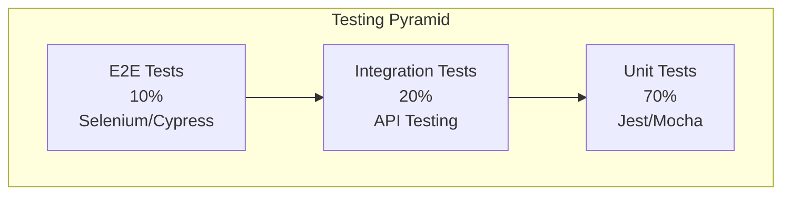

# TEST SPECIFICATION - COFFEE & TEA E-COMMERCE

## 1. Test Strategy Overview

### 1.1. Testing Pyramid


### 1.2. Testing Types
- **Unit Tests**: Individual functions, components, methods
- **Integration Tests**: API endpoints, database operations
- **E2E Tests**: Complete user workflows
- **Performance Tests**: Load testing, stress testing
- **Security Tests**: Vulnerability scanning, penetration testing
- **Usability Tests**: User experience validation

### 1.3. Testing Tools
**Frontend Testing:**
- Jest + React Testing Library / Vue Test Utils
- Cypress for E2E testing
- Lighthouse for performance
- ESLint + Prettier for code quality

**Backend Testing:**
- Jest + Supertest for API testing
- Artillery for load testing
- OWASP ZAP for security testing
- Postman for manual API testing

## 2. Unit Testing Specifications

### 2.1. Frontend Unit Tests

#### **Authentication Components**
```javascript
// __tests__/components/LoginForm.test.js
import { render, screen, fireEvent, waitFor } from '@testing-library/react';
import LoginForm from '../components/LoginForm';

describe('LoginForm Component', () => {
  it('should render login form correctly', () => {
    render(<LoginForm />);
    
    expect(screen.getByLabelText(/email/i)).toBeInTheDocument();
    expect(screen.getByLabelText(/password/i)).toBeInTheDocument();
    expect(screen.getByRole('button', { name: /login/i })).toBeInTheDocument();
  });
  
  it('should validate email format', async () => {
    render(<LoginForm />);
    
    const emailInput = screen.getByLabelText(/email/i);
    fireEvent.change(emailInput, { target: { value: 'invalid-email' } });
    fireEvent.blur(emailInput);
    
    await waitFor(() => {
      expect(screen.getByText(/invalid email format/i)).toBeInTheDocument();
    });
  });
  
  it('should submit form with valid data', async () => {
    const mockLogin = jest.fn();
    render(<LoginForm onLogin={mockLogin} />);
    
    fireEvent.change(screen.getByLabelText(/email/i), {
      target: { value: 'test@example.com' }
    });
    fireEvent.change(screen.getByLabelText(/password/i), {
      target: { value: 'password123' }
    });
    
    fireEvent.click(screen.getByRole('button', { name: /login/i }));
    
    await waitFor(() => {
      expect(mockLogin).toHaveBeenCalledWith({
        email: 'test@example.com',
        password: 'password123'
      });
    });
  });
});
```

#### **Product Components**
```javascript
// __tests__/components/ProductCard.test.js
describe('ProductCard Component', () => {
  const mockProduct = {
    id: '1',
    name: 'Vietnamese Drip Coffee',
    basePrice: 45000,
    images: ['image1.jpg'],
    rating: { average: 4.5, count: 128 },
    category: { name: 'Coffee' }
  };
  
  it('should display product information correctly', () => {
    render(<ProductCard product={mockProduct} />);
    
    expect(screen.getByText('Vietnamese Drip Coffee')).toBeInTheDocument();
    expect(screen.getByText('45,000 VND')).toBeInTheDocument();
    expect(screen.getByText('4.5')).toBeInTheDocument();
    expect(screen.getByText('(128 reviews)')).toBeInTheDocument();
  });
  
  it('should handle add to cart action', () => {
    const mockAddToCart = jest.fn();
    render(<ProductCard product={mockProduct} onAddToCart={mockAddToCart} />);
    
    fireEvent.click(screen.getByRole('button', { name: /add to cart/i }));
    
    expect(mockAddToCart).toHaveBeenCalledWith(mockProduct.id);
  });
});
```

#### **Shopping Cart Components**
```javascript
// __tests__/components/ShoppingCart.test.js
describe('ShoppingCart Component', () => {
  const mockCartItems = [
    {
      id: '1',
      product: { name: 'Coffee', images: ['img1.jpg'] },
      variant: { name: 'Medium', price: 50000 },
      quantity: 2,
      totalPrice: 100000
    }
  ];
  
  it('should display cart items correctly', () => {
    render(<ShoppingCart items={mockCartItems} />);
    
    expect(screen.getByText('Coffee')).toBeInTheDocument();
    expect(screen.getByText('Medium')).toBeInTheDocument();
    expect(screen.getByText('2')).toBeInTheDocument();
    expect(screen.getByText('100,000 VND')).toBeInTheDocument();
  });
  
  it('should update quantity', () => {
    const mockUpdateQuantity = jest.fn();
    render(<ShoppingCart items={mockCartItems} onUpdateQuantity={mockUpdateQuantity} />);
    
    const quantityInput = screen.getByDisplayValue('2');
    fireEvent.change(quantityInput, { target: { value: '3' } });
    
    expect(mockUpdateQuantity).toHaveBeenCalledWith('1', 3);
  });
});
```

### 2.2. Backend Unit Tests

#### **Authentication Service**
```javascript
// __tests__/services/authService.test.js
const AuthService = require('../services/authService');
const bcrypt = require('bcrypt');
const jwt = require('jsonwebtoken');

describe('AuthService', () => {
  let authService;
  
  beforeEach(() => {
    authService = new AuthService();
  });
  
  describe('hashPassword', () => {
    it('should hash password correctly', async () => {
      const password = 'testpassword';
      const hashedPassword = await authService.hashPassword(password);
      
      expect(hashedPassword).toBeDefined();
      expect(hashedPassword).not.toBe(password);
      expect(await bcrypt.compare(password, hashedPassword)).toBe(true);
    });
  });
  
  describe('generateTokens', () => {
    it('should generate valid JWT tokens', () => {
      const user = { id: '1', email: 'test@example.com', role: 'customer' };
      const tokens = authService.generateTokens(user);
      
      expect(tokens.accessToken).toBeDefined();
      expect(tokens.refreshToken).toBeDefined();
      
      const decoded = jwt.verify(tokens.accessToken, process.env.JWT_SECRET);
      expect(decoded.userId).toBe(user.id);
      expect(decoded.email).toBe(user.email);
    });
  });
  
  describe('validateUser', () => {
    it('should validate correct credentials', async () => {
      const mockUser = {
        id: '1',
        email: 'test@example.com',
        passwordHash: await bcrypt.hash('password123', 12)
      };
      
      const isValid = await authService.validateUser('test@example.com', 'password123', mockUser);
      
      expect(isValid).toBe(true);
    });
    
    it('should reject incorrect credentials', async () => {
      const mockUser = {
        id: '1',
        email: 'test@example.com',
        passwordHash: await bcrypt.hash('password123', 12)
      };
      
      const isValid = await authService.validateUser('test@example.com', 'wrongpassword', mockUser);
      
      expect(isValid).toBe(false);
    });
  });
});
```

#### **Product Service**
```javascript
// __tests__/services/productService.test.js
const ProductService = require('../services/productService');
const { Pool } = require('pg');

jest.mock('pg');

describe('ProductService', () => {
  let productService;
  let mockDb;
  
  beforeEach(() => {
    mockDb = {
      query: jest.fn()
    };
    Pool.mockImplementation(() => mockDb);
    productService = new ProductService();
  });
  
  describe('getProducts', () => {
    it('should return paginated products', async () => {
      const mockProducts = [
        { id: '1', name: 'Coffee 1', base_price: 45000 },
        { id: '2', name: 'Coffee 2', base_price: 50000 }
      ];
      
      mockDb.query.mockResolvedValue({ rows: mockProducts });
      
      const result = await productService.getProducts({ page: 1, limit: 20 });
      
      expect(result.products).toEqual(mockProducts);
      expect(mockDb.query).toHaveBeenCalledWith(
        expect.stringContaining('SELECT * FROM products'),
        expect.any(Array)
      );
    });
    
    it('should filter products by category', async () => {
      await productService.getProducts({ category: 'coffee', page: 1, limit: 20 });
      
      expect(mockDb.query).toHaveBeenCalledWith(
        expect.stringContaining('WHERE category_id'),
        expect.arrayContaining(['coffee'])
      );
    });
  });
  
  describe('searchProducts', () => {
    it('should search products by name', async () => {
      const mockResults = [
        { id: '1', name: 'Vietnamese Coffee', base_price: 45000 }
      ];
      
      mockDb.query.mockResolvedValue({ rows: mockResults });
      
      const result = await productService.searchProducts('vietnamese');
      
      expect(result).toEqual(mockResults);
      expect(mockDb.query).toHaveBeenCalledWith(
        expect.stringContaining('WHERE name ILIKE'),
        expect.arrayContaining(['%vietnamese%'])
      );
    });
  });
});
```

#### **Order Service**
```javascript
// __tests__/services/orderService.test.js
describe('OrderService', () => {
  let orderService;
  let mockDb;
  
  beforeEach(() => {
    mockDb = { query: jest.fn() };
    orderService = new OrderService(mockDb);
  });
  
  describe('createOrder', () => {
    it('should create order with correct data', async () => {
      const orderData = {
        userId: 'user-1',
        items: [
          { productId: 'prod-1', variantId: 'var-1', quantity: 2, unitPrice: 50000 }
        ],
        customerInfo: {
          email: 'test@example.com',
          fullName: 'John Doe',
          phone: '0901234567'
        },
        shippingAddress: {
          addressLine: '123 Main St',
          city: 'Ho Chi Minh City'
        }
      };
      
      const mockOrder = { id: 'order-1', orderNumber: 'ORD-001' };
      mockDb.query.mockResolvedValue({ rows: [mockOrder] });
      
      const result = await orderService.createOrder(orderData);
      
      expect(result).toEqual(mockOrder);
      expect(mockDb.query).toHaveBeenCalledWith(
        expect.stringContaining('INSERT INTO orders'),
        expect.any(Array)
      );
    });
    
    it('should calculate order total correctly', () => {
      const items = [
        { unitPrice: 50000, quantity: 2 },
        { unitPrice: 30000, quantity: 1 }
      ];
      
      const total = orderService.calculateTotal(items, 25000, 10000, 0);
      
      expect(total).toBe(145000); // (50000*2 + 30000*1) + 25000 - 10000
    });
  });
  
  describe('updateOrderStatus', () => {
    it('should update order status and history', async () => {
      const orderId = 'order-1';
      const newStatus = 'confirmed';
      
      await orderService.updateOrderStatus(orderId, newStatus, 'Payment confirmed');
      
      expect(mockDb.query).toHaveBeenCalledWith(
        expect.stringContaining('UPDATE orders SET status'),
        expect.arrayContaining([newStatus, orderId])
      );
    });
  });
});
```

## 3. Integration Testing

### 3.1. API Integration Tests

#### **Authentication Endpoints**
```javascript
// __tests__/integration/auth.test.js
const request = require('supertest');
const app = require('../../app');

describe('Authentication Endpoints', () => {
  describe('POST /api/v1/auth/register', () => {
    it('should register new user successfully', async () => {
      const userData = {
        email: 'newuser@example.com',
        password: 'SecurePass123',
        fullName: 'New User',
        phone: '0901234567',
        address: {
          addressLine: '123 Test St',
          city: 'Ho Chi Minh City',
          district: 'District 1'
        }
      };
      
      const response = await request(app)
        .post('/api/v1/auth/register')
        .send(userData)
        .expect(201);
      
      expect(response.body.success).toBe(true);
      expect(response.body.data.user.email).toBe(userData.email);
      expect(response.body.data.accessToken).toBeDefined();
    });
    
    it('should reject duplicate email registration', async () => {
      const userData = {
        email: 'existing@example.com',
        password: 'SecurePass123',
        fullName: 'Existing User'
      };
      
      // Register first time
      await request(app)
        .post('/api/v1/auth/register')
        .send(userData);
      
      // Try to register again
      const response = await request(app)
        .post('/api/v1/auth/register')
        .send(userData)
        .expect(400);
      
      expect(response.body.success).toBe(false);
      expect(response.body.error.message).toContain('email already exists');
    });
  });
  
  describe('POST /api/v1/auth/login', () => {
    it('should login with valid credentials', async () => {
      const loginData = {
        email: 'test@example.com',
        password: 'password123'
      };
      
      const response = await request(app)
        .post('/api/v1/auth/login')
        .send(loginData)
        .expect(200);
      
      expect(response.body.success).toBe(true);
      expect(response.body.data.accessToken).toBeDefined();
      expect(response.body.data.user.email).toBe(loginData.email);
    });
    
    it('should reject invalid credentials', async () => {
      const loginData = {
        email: 'test@example.com',
        password: 'wrongpassword'
      };
      
      const response = await request(app)
        .post('/api/v1/auth/login')
        .send(loginData)
        .expect(401);
      
      expect(response.body.success).toBe(false);
      expect(response.body.error.message).toContain('Invalid credentials');
    });
  });
});
```

#### **Product Endpoints**
```javascript
// __tests__/integration/products.test.js
describe('Product Endpoints', () => {
  let authToken;
  
  beforeAll(async () => {
    // Login to get auth token
    const loginResponse = await request(app)
      .post('/api/v1/auth/login')
      .send({ email: 'test@example.com', password: 'password123' });
    
    authToken = loginResponse.body.data.accessToken;
  });
  
  describe('GET /api/v1/products', () => {
    it('should return paginated products', async () => {
      const response = await request(app)
        .get('/api/v1/products?page=1&limit=10')
        .expect(200);
      
      expect(response.body.success).toBe(true);
      expect(response.body.data.products).toBeInstanceOf(Array);
      expect(response.body.pagination).toBeDefined();
      expect(response.body.pagination.page).toBe(1);
      expect(response.body.pagination.limit).toBe(10);
    });
    
    it('should filter products by category', async () => {
      const response = await request(app)
        .get('/api/v1/products?category=coffee-espresso')
        .expect(200);
      
      expect(response.body.data.products).toBeInstanceOf(Array);
      response.body.data.products.forEach(product => {
        expect(product.category.slug).toBe('coffee-espresso');
      });
    });
    
    it('should sort products by price', async () => {
      const response = await request(app)
        .get('/api/v1/products?sort=price_asc')
        .expect(200);
      
      const products = response.body.data.products;
      for (let i = 1; i < products.length; i++) {
        expect(products[i].basePrice).toBeGreaterThanOrEqual(products[i-1].basePrice);
      }
    });
  });
  
  describe('GET /api/v1/products/:id', () => {
    it('should return product details with variants', async () => {
      const productId = 'existing-product-id';
      
      const response = await request(app)
        .get(`/api/v1/products/${productId}`)
        .expect(200);
      
      expect(response.body.data.product.id).toBe(productId);
      expect(response.body.data.product.variants).toBeInstanceOf(Array);
      expect(response.body.data.product.variants.length).toBeGreaterThanOrEqual(2);
    });
    
    it('should return 404 for non-existent product', async () => {
      const response = await request(app)
        .get('/api/v1/products/non-existent-id')
        .expect(404);
      
      expect(response.body.success).toBe(false);
    });
  });
});
```

#### **Shopping Cart Endpoints**
```javascript
// __tests__/integration/cart.test.js
describe('Shopping Cart Endpoints', () => {
  let authToken;
  
  beforeAll(async () => {
    const loginResponse = await request(app)
      .post('/api/v1/auth/login')
      .send({ email: 'test@example.com', password: 'password123' });
    
    authToken = loginResponse.body.data.accessToken;
  });
  
  describe('POST /api/v1/cart/items', () => {
    it('should add item to cart', async () => {
      const cartItem = {
        productId: 'product-1',
        variantId: 'variant-1',
        quantity: 2
      };
      
      const response = await request(app)
        .post('/api/v1/cart/items')
        .set('Authorization', `Bearer ${authToken}`)
        .send(cartItem)
        .expect(201);
      
      expect(response.body.success).toBe(true);
      expect(response.body.data.item.quantity).toBe(2);
    });
    
    it('should update quantity if item already exists', async () => {
      const cartItem = {
        productId: 'product-1',
        variantId: 'variant-1',
        quantity: 1
      };
      
      // Add item first time
      await request(app)
        .post('/api/v1/cart/items')
        .set('Authorization', `Bearer ${authToken}`)
        .send(cartItem);
      
      // Add same item again
      const response = await request(app)
        .post('/api/v1/cart/items')
        .set('Authorization', `Bearer ${authToken}`)
        .send(cartItem)
        .expect(200);
      
      expect(response.body.data.item.quantity).toBe(2);
    });
  });
  
  describe('GET /api/v1/cart', () => {
    it('should return user cart with calculated totals', async () => {
      const response = await request(app)
        .get('/api/v1/cart')
        .set('Authorization', `Bearer ${authToken}`)
        .expect(200);
      
      expect(response.body.data.cart.items).toBeInstanceOf(Array);
      expect(response.body.data.cart.summary).toBeDefined();
      expect(response.body.data.cart.summary.subtotal).toBeGreaterThanOrEqual(0);
      expect(response.body.data.cart.summary.total).toBeGreaterThanOrEqual(0);
    });
  });
});
```

### 3.2. Database Integration Tests

#### **Database Operations**
```javascript
// __tests__/integration/database.test.js
const { Pool } = require('pg');
const config = require('../../config/database');

describe('Database Operations', () => {
  let db;
  
  beforeAll(async () => {
    db = new Pool(config.test);
  });
  
  afterAll(async () => {
    await db.end();
  });
  
  describe('User Operations', () => {
    it('should create and retrieve user', async () => {
      const userData = {
        email: 'dbtest@example.com',
        passwordHash: 'hashed-password',
        fullName: 'DB Test User'
      };
      
      // Create user
      const insertResult = await db.query(
        'INSERT INTO users (email, password_hash, full_name) VALUES ($1, $2, $3) RETURNING *',
        [userData.email, userData.passwordHash, userData.fullName]
      );
      
      expect(insertResult.rows[0].email).toBe(userData.email);
      
      // Retrieve user
      const selectResult = await db.query(
        'SELECT * FROM users WHERE email = $1',
        [userData.email]
      );
      
      expect(selectResult.rows[0].full_name).toBe(userData.fullName);
    });
    
    it('should enforce unique email constraint', async () => {
      const email = 'unique-test@example.com';
      
      // Insert first user
      await db.query(
        'INSERT INTO users (email, password_hash, full_name) VALUES ($1, $2, $3)',
        [email, 'hash1', 'User 1']
      );
      
      // Try to insert duplicate email
      await expect(
        db.query(
          'INSERT INTO users (email, password_hash, full_name) VALUES ($1, $2, $3)',
          [email, 'hash2', 'User 2']
        )
      ).rejects.toThrow();
    });
  });
  
  describe('Product Operations', () => {
    it('should create product with variants', async () => {
      // Create product
      const productResult = await db.query(
        'INSERT INTO products (name, description, base_price, category_id) VALUES ($1, $2, $3, $4) RETURNING *',
        ['Test Product', 'Test description', 50000, 'category-1']
      );
      
      const productId = productResult.rows[0].id;
      
      // Create variants
      const variant1 = await db.query(
        'INSERT INTO product_variants (product_id, variant_name, variant_type, stock_quantity) VALUES ($1, $2, $3, $4) RETURNING *',
        [productId, 'Small', 'size', 100]
      );
      
      const variant2 = await db.query(
        'INSERT INTO product_variants (product_id, variant_name, variant_type, stock_quantity) VALUES ($1, $2, $3, $4) RETURNING *',
        [productId, 'Large', 'size', 50]
      );
      
      // Verify variants exist
      const variantsResult = await db.query(
        'SELECT * FROM product_variants WHERE product_id = $1',
        [productId]
      );
      
      expect(variantsResult.rows).toHaveLength(2);
    });
  });
});
```

## 4. End-to-End Testing

### 4.1. User Journey Tests

#### **Complete Purchase Flow**
```javascript
// cypress/integration/purchase-flow.spec.js
describe('Complete Purchase Flow', () => {
  beforeEach(() => {
    cy.visit('/');
  });
  
  it('should allow guest user to complete purchase', () => {
    // Browse products
    cy.get('[data-cy=product-card]').first().click();
    
    // Select variant
    cy.get('[data-cy=variant-selector]').select('Medium');
    cy.get('[data-cy=preparation-selector]').select('Hot');
    
    // Add to cart
    cy.get('[data-cy=add-to-cart]').click();
    cy.get('[data-cy=cart-notification]').should('contain', 'Added to cart');
    
    // Go to cart
    cy.get('[data-cy=cart-icon]').click();
    cy.get('[data-cy=cart-item]').should('have.length', 1);
    
    // Proceed to checkout
    cy.get('[data-cy=checkout-button]').click();
    
    // Fill checkout form
    cy.get('[data-cy=customer-email]').type('guest@example.com');
    cy.get('[data-cy=customer-name]').type('Guest User');
    cy.get('[data-cy=customer-phone]').type('0901234567');
    cy.get('[data-cy=address-line]').type('123 Test Street');
    cy.get('[data-cy=city]').type('Ho Chi Minh City');
    cy.get('[data-cy=district]').type('District 1');
    
    // Apply discount code
    cy.get('[data-cy=discount-code]').type('SAVE15');
    cy.get('[data-cy=apply-discount]').click();
    cy.get('[data-cy=discount-success]').should('contain', '15% discount applied');
    
    // Complete order
    cy.get('[data-cy=place-order]').click();
    
    // Verify success page
    cy.url().should('include', '/order-success');
    cy.get('[data-cy=order-number]').should('exist');
    cy.get('[data-cy=order-total]').should('exist');
  });
  
  it('should allow registered user to purchase with saved address', () => {
    // Login
    cy.get('[data-cy=login-button]').click();
    cy.get('[data-cy=email-input]').type('test@example.com');
    cy.get('[data-cy=password-input]').type('password123');
    cy.get('[data-cy=login-submit]').click();
    
    // Add product to cart
    cy.get('[data-cy=product-card]').first().click();
    cy.get('[data-cy=add-to-cart]').click();
    
    // Checkout with saved address
    cy.get('[data-cy=cart-icon]').click();
    cy.get('[data-cy=checkout-button]').click();
    
    // Verify address is pre-filled
    cy.get('[data-cy=address-line]').should('not.be.empty');
    
    // Use loyalty points
    cy.get('[data-cy=use-points]').click();
    cy.get('[data-cy=points-input]').type('50');
    cy.get('[data-cy=apply-points]').click();
    
    // Complete purchase
    cy.get('[data-cy=place-order]').click();
    cy.get('[data-cy=order-success]').should('be.visible');
  });
});
```

#### **Admin Dashboard Flow**
```javascript
// cypress/integration/admin-dashboard.spec.js
describe('Admin Dashboard', () => {
  beforeEach(() => {
    // Login as admin
    cy.visit('/admin/login');
    cy.get('[data-cy=username]').type('admin');
    cy.get('[data-cy=password]').type('admin');
    cy.get('[data-cy=login-submit]').click();
  });
  
  it('should display dashboard metrics', () => {
    cy.url().should('include', '/admin/dashboard');
    
    // Verify metrics display
    cy.get('[data-cy=total-users]').should('exist');
    cy.get('[data-cy=total-orders]').should('exist');
    cy.get('[data-cy=revenue]').should('exist');
    
    // Verify charts
    cy.get('[data-cy=sales-chart]').should('be.visible');
    cy.get('[data-cy=bestsellers-chart]').should('be.visible');
  });
  
  it('should allow product management', () => {
    // Navigate to products
    cy.get('[data-cy=products-menu]').click();
    cy.get('[data-cy=product-list]').should('be.visible');
    
    // Add new product
    cy.get('[data-cy=add-product]').click();
    cy.get('[data-cy=product-name]').type('New Test Coffee');
    cy.get('[data-cy=product-description]').type('A delicious test coffee with amazing flavor and aroma that will satisfy your taste buds.');
    cy.get('[data-cy=base-price]').type('55000');
    cy.get('[data-cy=category-select]').select('Coffee & Espresso');
    cy.get('[data-cy=brand-select]').select('Test Brand');
    
    // Add variants
    cy.get('[data-cy=add-variant]').click();
    cy.get('[data-cy=variant-name-0]').type('Small');
    cy.get('[data-cy=variant-type-0]').select('size');
    cy.get('[data-cy=variant-stock-0]').type('100');
    
    cy.get('[data-cy=add-variant]').click();
    cy.get('[data-cy=variant-name-1]').type('Large');
    cy.get('[data-cy=variant-type-1]').select('size');
    cy.get('[data-cy=variant-price-1]').type('10000');
    cy.get('[data-cy=variant-stock-1]').type('50');
    
    // Upload images
    cy.get('[data-cy=image-upload]').selectFile(['cypress/fixtures/coffee1.jpg', 'cypress/fixtures/coffee2.jpg', 'cypress/fixtures/coffee3.jpg']);
    
    // Save product
    cy.get('[data-cy=save-product]').click();
    cy.get('[data-cy=success-message]').should('contain', 'Product created successfully');
  });
  
  it('should allow order status updates', () => {
    // Navigate to orders
    cy.get('[data-cy=orders-menu]').click();
    
    // Filter by pending orders
    cy.get('[data-cy=status-filter]').select('pending');
    cy.get('[data-cy=filter-apply]').click();
    
    // Update first order status
    cy.get('[data-cy=order-row]').first().click();
    cy.get('[data-cy=status-select]').select('confirmed');
    cy.get('[data-cy=status-note]').type('Payment verified and order confirmed');
    cy.get('[data-cy=update-status]').click();
    
    // Verify status updated
    cy.get('[data-cy=status-success]').should('contain', 'Order status updated');
    cy.get('[data-cy=current-status]').should('contain', 'confirmed');
  });
});
```

### 4.2. Mobile Responsiveness Tests

```javascript
// cypress/integration/mobile-responsive.spec.js
describe('Mobile Responsiveness', () => {
  const viewports = [
    { device: 'iphone-6', width: 375, height: 667 },
    { device: 'ipad-2', width: 768, height: 1024 },
    { device: 'samsung-s10', width: 360, height: 760 }
  ];
  
  viewports.forEach(viewport => {
    describe(`${viewport.device} (${viewport.width}x${viewport.height})`, () => {
      beforeEach(() => {
        cy.viewport(viewport.width, viewport.height);
        cy.visit('/');
      });
      
      it('should display mobile navigation', () => {
        cy.get('[data-cy=mobile-menu-toggle]').should('be.visible');
        cy.get('[data-cy=desktop-navigation]').should('not.be.visible');
        
        // Test mobile menu
        cy.get('[data-cy=mobile-menu-toggle]').click();
        cy.get('[data-cy=mobile-menu]').should('be.visible');
        cy.get('[data-cy=mobile-menu-close]').click();
        cy.get('[data-cy=mobile-menu]').should('not.be.visible');
      });
      
      it('should have touch-friendly product cards', () => {
        cy.get('[data-cy=product-card]').first().then($card => {
          const cardHeight = $card.height();
          expect(cardHeight).to.be.at.least(44); // Minimum touch target size
        });
        
        cy.get('[data-cy=product-card] [data-cy=add-to-cart]').first().then($button => {
          const buttonHeight = $button.height();
          expect(buttonHeight).to.be.at.least(44);
        });
      });
      
      it('should have readable text and proper spacing', () => {
        cy.get('[data-cy=product-name]').first().should('have.css', 'font-size').and('match', /^(14|16|18)px$/);
        cy.get('[data-cy=product-price]').first().should('be.visible');
      });
    });
  });
});
```

## 5. Performance Testing

### 5.1. Load Testing with Artillery

```yaml
# artillery-config.yml
config:
  target: 'http://localhost:3000'
  phases:
    - duration: 60
      arrivalRate: 10
      name: "Warm up"
    - duration: 120
      arrivalRate: 50
      name: "Normal load"
    - duration: 60
      arrivalRate: 100
      name: "High load"
  defaults:
    headers:
      Content-Type: 'application/json'

scenarios:
  - name: "Browse products"
    weight: 40
    flow:
      - get:
          url: "/api/v1/products"
      - get:
          url: "/api/v1/products/{{ $randomString() }}"
      - get:
          url: "/api/v1/categories"

  - name: "User registration and login"
    weight: 20
    flow:
      - post:
          url: "/api/v1/auth/register"
          json:
            email: "user{{ $randomInt(1, 10000) }}@example.com"
            password: "password123"
            fullName: "Test User {{ $randomInt(1, 1000) }}"
      - post:
          url: "/api/v1/auth/login"
          json:
            email: "{{ email }}"
            password: "password123"

  - name: "Shopping cart operations"
    weight: 30
    flow:
      - post:
          url: "/api/v1/auth/login"
          json:
            email: "test@example.com"
            password: "password123"
          capture:
            - json: "$.data.accessToken"
              as: "authToken"
      - post:
          url: "/api/v1/cart/items"
          headers:
            Authorization: "Bearer {{ authToken }}"
          json:
            productId: "{{ $randomString() }}"
            variantId: "{{ $randomString() }}"
            quantity: "{{ $randomInt(1, 5) }}"
      - get:
          url: "/api/v1/cart"
          headers:
            Authorization: "Bearer {{ authToken }}"

  - name: "Order creation"
    weight: 10
    flow:
      - post:
          url: "/api/v1/auth/login"
          json:
            email: "test@example.com"
            password: "password123"
          capture:
            - json: "$.data.accessToken"
              as: "authToken"
      - post:
          url: "/api/v1/orders"
          headers:
            Authorization: "Bearer {{ authToken }}"
          json:
            customerInfo:
              email: "customer{{ $randomInt(1, 1000) }}@example.com"
              fullName: "Customer {{ $randomInt(1, 1000) }}"
              phone: "090123456{{ $randomInt(0, 9) }}"
            items:
              - productId: "test-product-1"
                variantId: "test-variant-1"
                quantity: 2
                unitPrice: 50000
```

### 5.2. Performance Benchmarks

```javascript
// __tests__/performance/api-performance.test.js
const request = require('supertest');
const app = require('../../app');

describe('API Performance Tests', () => {
  describe('Product endpoints performance', () => {
    it('should respond to GET /products within 500ms', async () => {
      const start = Date.now();
      
      await request(app)
        .get('/api/v1/products')
        .expect(200);
      
      const duration = Date.now() - start;
      expect(duration).toBeLessThan(500);
    });
    
    it('should handle 100 concurrent product requests', async () => {
      const requests = Array(100).fill().map(() => 
        request(app).get('/api/v1/products')
      );
      
      const start = Date.now();
      const responses = await Promise.all(requests);
      const duration = Date.now() - start;
      
      responses.forEach(response => {
        expect(response.status).toBe(200);
      });
      
      expect(duration).toBeLessThan(5000); // All requests within 5 seconds
    });
  });
  
  describe('Database query performance', () => {
    it('should execute product search within 100ms', async () => {
      const ProductService = require('../../services/productService');
      const productService = new ProductService();
      
      const start = Date.now();
      await productService.searchProducts('coffee');
      const duration = Date.now() - start;
      
      expect(duration).toBeLessThan(100);
    });
  });
});
```

## 6. Security Testing

### 6.1. Input Validation Tests

```javascript
// __tests__/security/input-validation.test.js
describe('Input Validation Security', () => {
  describe('SQL Injection Protection', () => {
    it('should prevent SQL injection in search', async () => {
      const maliciousInput = "'; DROP TABLE users; --";
      
      const response = await request(app)
        .get(`/api/v1/products/search?q=${encodeURIComponent(maliciousInput)}`)
        .expect(200);
      
      expect(response.body.success).toBe(true);
      // Should return empty results, not error
      expect(response.body.data.products).toEqual([]);
    });
    
    it('should sanitize user input in registration', async () => {
      const maliciousData = {
        email: 'test@example.com',
        fullName: '<script>alert("xss")</script>John Doe',
        password: 'password123'
      };
      
      const response = await request(app)
        .post('/api/v1/auth/register')
        .send(maliciousData)
        .expect(201);
      
      expect(response.body.data.user.fullName).not.toContain('<script>');
    });
  });
  
  describe('Authentication Security', () => {
    it('should rate limit login attempts', async () => {
      const loginData = {
        email: 'test@example.com',
        password: 'wrongpassword'
      };
      
      // Make 6 failed login attempts (limit is 5)
      const attempts = Array(6).fill().map(() => 
        request(app)
          .post('/api/v1/auth/login')
          .send(loginData)
      );
      
      const responses = await Promise.all(attempts);
      
      // Last attempt should be rate limited
      expect(responses[5].status).toBe(429);
    });
    
    it('should require strong passwords', async () => {
      const weakPasswords = ['123', 'password', 'abc123'];
      
      for (const password of weakPasswords) {
        const response = await request(app)
          .post('/api/v1/auth/register')
          .send({
            email: `test-${Date.now()}@example.com`,
            password: password,
            fullName: 'Test User'
          });
        
        expect(response.status).toBe(400);
        expect(response.body.error.message).toContain('password');
      }
    });
  });
});
```

### 6.2. Authorization Tests

```javascript
// __tests__/security/authorization.test.js
describe('Authorization Security', () => {
  let userToken, adminToken;
  
  beforeAll(async () => {
    // Get user token
    const userLogin = await request(app)
      .post('/api/v1/auth/login')
      .send({ email: 'user@example.com', password: 'password123' });
    userToken = userLogin.body.data.accessToken;
    
    // Get admin token
    const adminLogin = await request(app)
      .post('/api/v1/auth/login')
      .send({ email: 'admin@example.com', password: 'adminpass' });
    adminToken = adminLogin.body.data.accessToken;
  });
  
  it('should prevent users from accessing admin endpoints', async () => {
    const response = await request(app)
      .get('/api/v1/admin/dashboard')
      .set('Authorization', `Bearer ${userToken}`)
      .expect(403);
    
    expect(response.body.error.message).toContain('Access denied');
  });
  
  it('should allow admin access to admin endpoints', async () => {
    await request(app)
      .get('/api/v1/admin/dashboard')
      .set('Authorization', `Bearer ${adminToken}`)
      .expect(200);
  });
  
  it('should prevent users from modifying other users data', async () => {
    // Try to update another user's profile
    const response = await request(app)
      .put('/api/v1/users/another-user-id/profile')
      .set('Authorization', `Bearer ${userToken}`)
      .send({ fullName: 'Hacked Name' })
      .expect(403);
    
    expect(response.body.error.message).toContain('Access denied');
  });
});
```

## 7. Test Coverage Requirements

### 7.1. Coverage Targets
- **Overall Coverage**: ≥ 80%
- **Backend Services**: ≥ 90%
- **Frontend Components**: ≥ 75%
- **API Endpoints**: ≥ 85%
- **Critical Business Logic**: 100%

### 7.2. Coverage Report Configuration

```javascript
// jest.config.js
module.exports = {
  collectCoverage: true,
  coverageDirectory: 'coverage',
  coveragePathIgnorePatterns: [
    '/node_modules/',
    '/tests/',
    '/coverage/',
    '/dist/'
  ],
  coverageReporters: [
    'text',
    'lcov',
    'html',
    'json-summary'
  ],
  coverageThreshold: {
    global: {
      branches: 80,
      functions: 80,
      lines: 80,
      statements: 80
    },
    './src/services/': {
      branches: 90,
      functions: 90,
      lines: 90,
      statements: 90
    }
  }
};
```

### 7.3. Test Execution Pipeline

```yaml
# .github/workflows/test.yml
name: Test Suite

on: [push, pull_request]

jobs:
  test:
    runs-on: ubuntu-latest
    
    steps:
    - uses: actions/checkout@v3
    
    - name: Setup Node.js
      uses: actions/setup-node@v3
      with:
        node-version: '18'
        cache: 'npm'
    
    - name: Install dependencies
      run: npm ci
    
    - name: Run unit tests
      run: npm run test:unit
    
    - name: Run integration tests
      run: npm run test:integration
    
    - name: Run E2E tests
      run: npm run test:e2e
    
    - name: Generate coverage report
      run: npm run test:coverage
    
    - name: Upload coverage to Codecov
      uses: codecov/codecov-action@v3
      with:
        file: ./coverage/lcov.info
    
    - name: Performance tests
      run: npm run test:performance
```

Specification này đảm bảo:
- **Comprehensive Testing**: Unit, Integration, E2E, Performance, Security
- **High Coverage**: Đạt targets theo yêu cầu
- **Automated Testing**: CI/CD integration
- **Quality Assurance**: Multiple testing layers
- **Performance Validation**: Load testing và benchmarks
- **Security Validation**: Input validation và authorization testing
