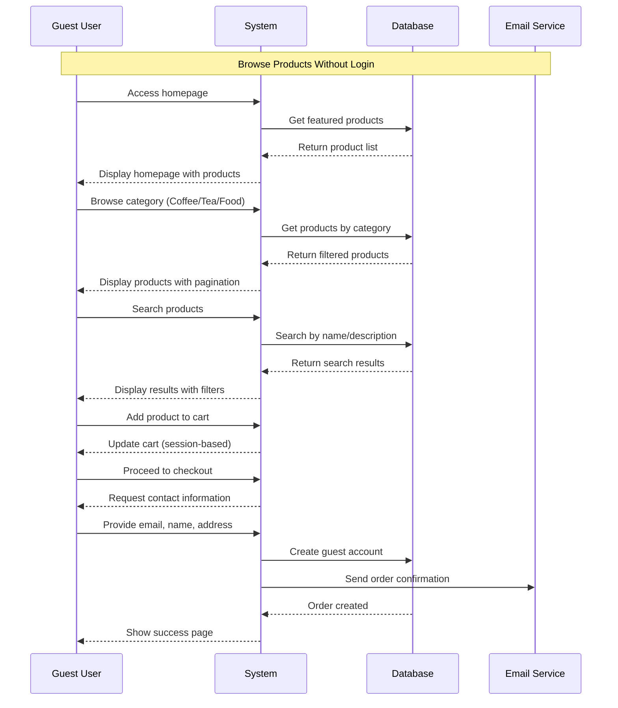
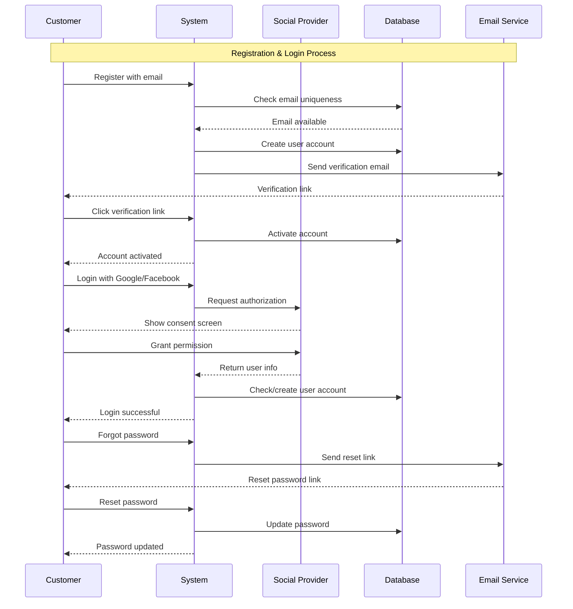
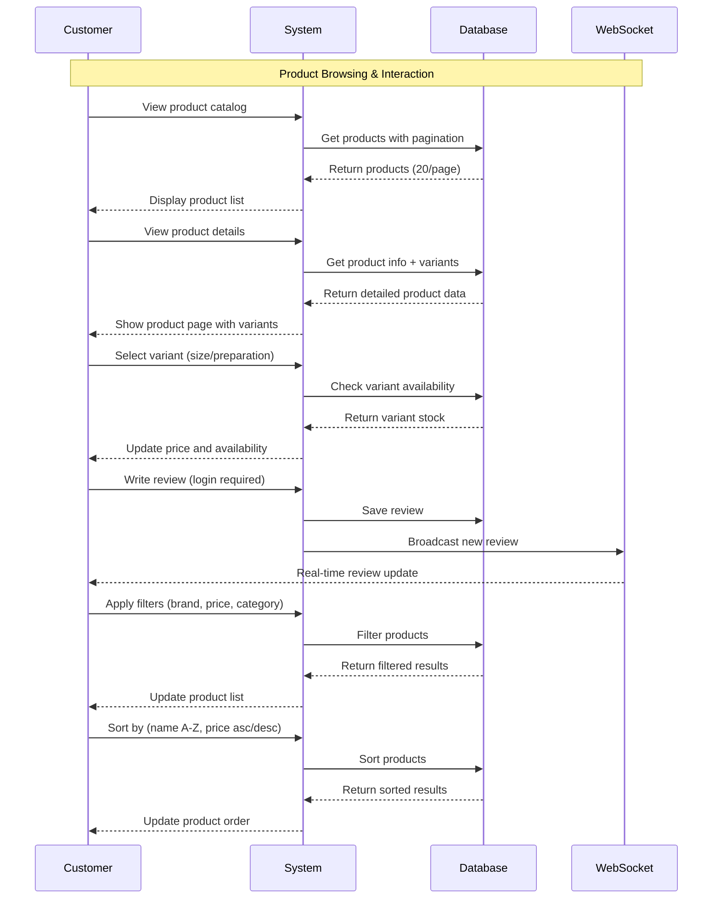
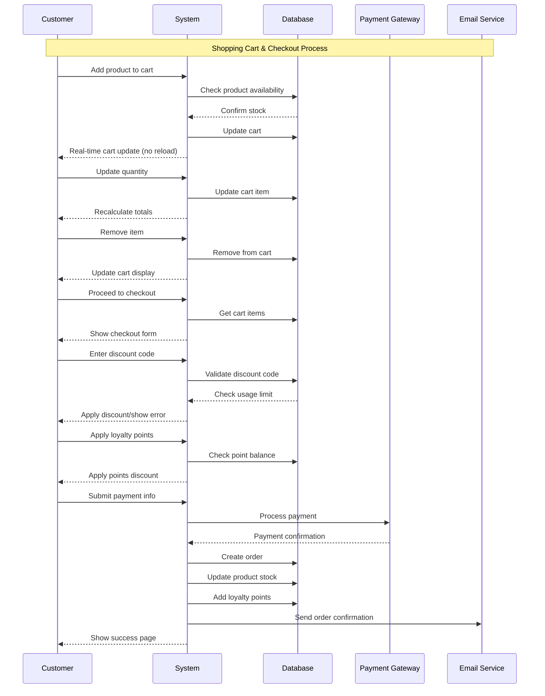
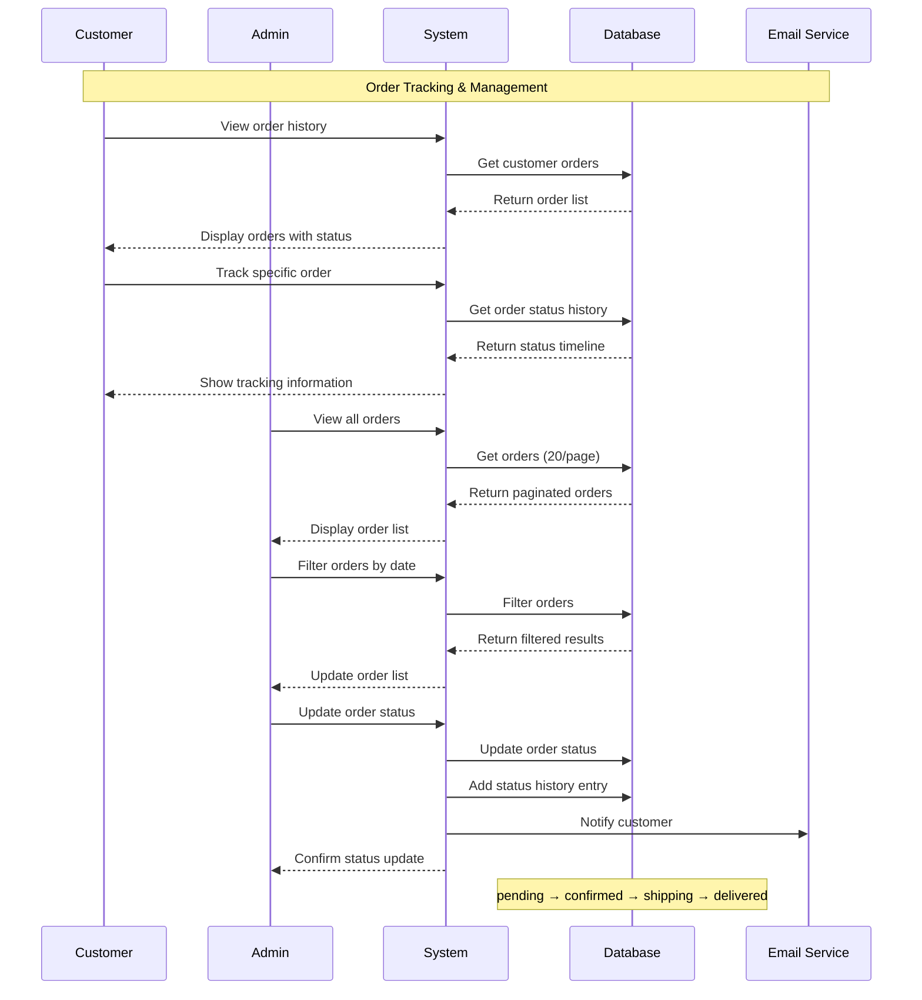
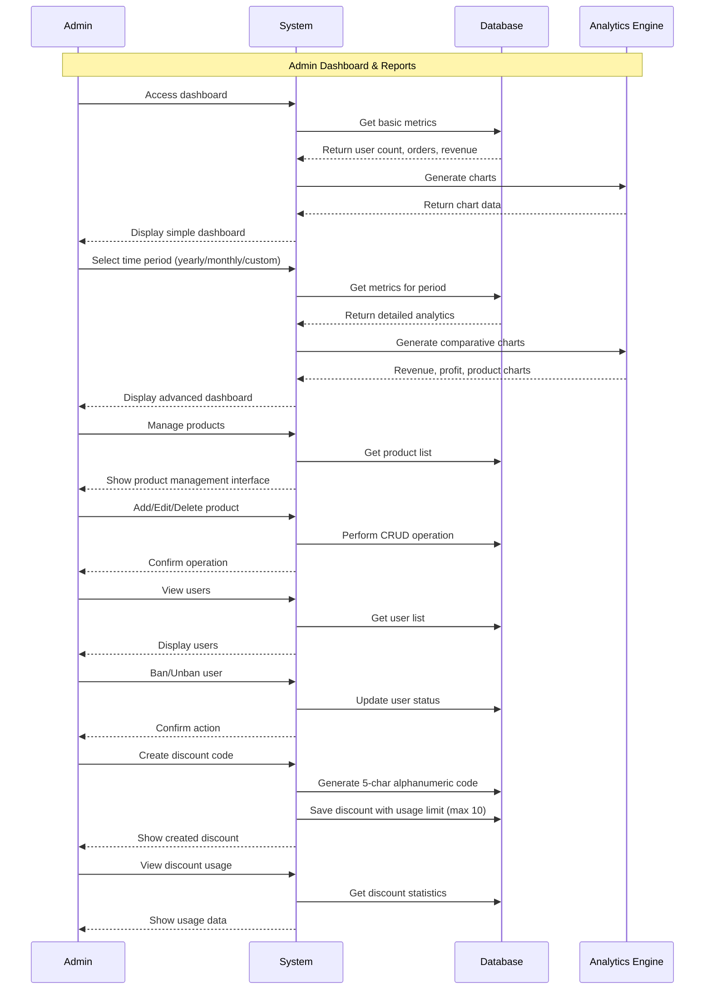
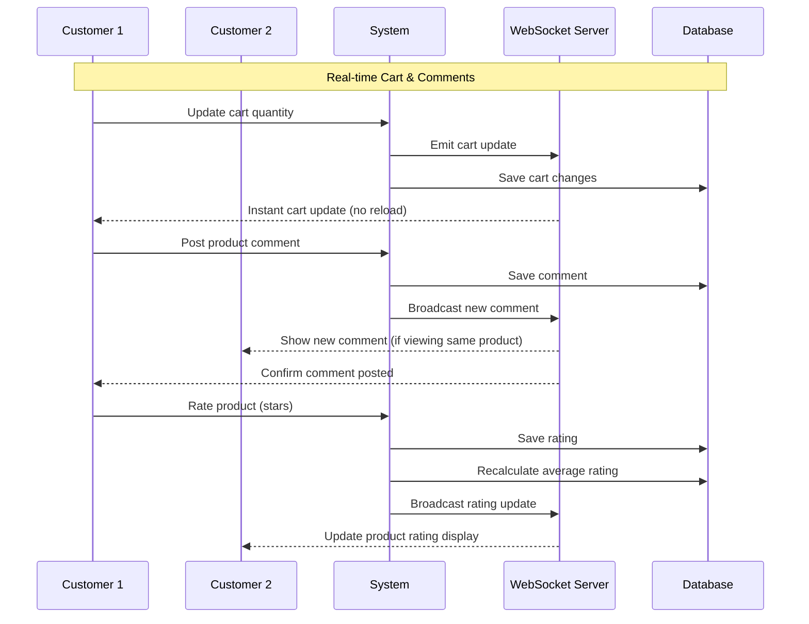
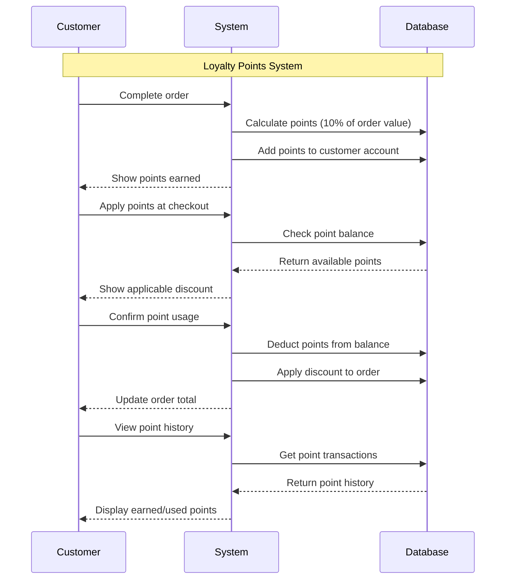
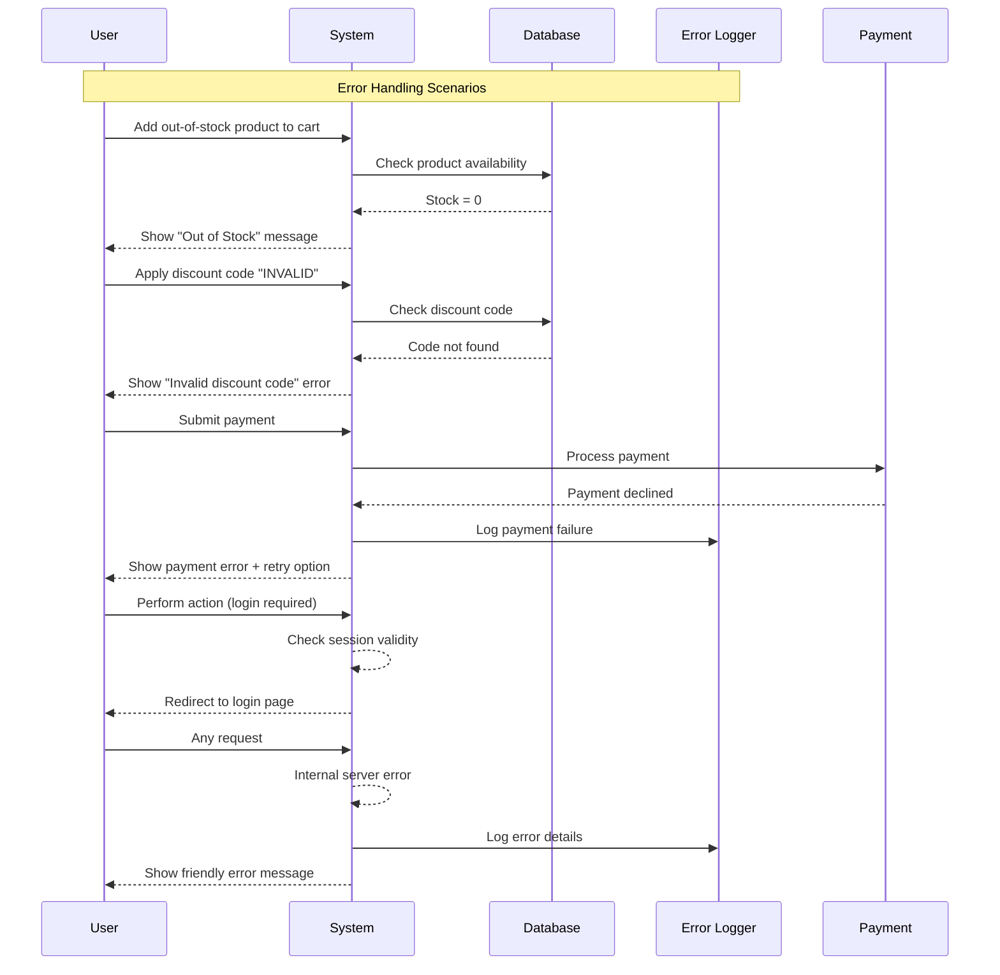

# USE CASE DIAGRAM - COFFEE & TEA E-COMMERCE WEBSITE

## 1. Biểu đồ Use Case Tổng Quát

```mermaid
graph TB
    %% Actors
    Customer((Customer))
    Admin((Admin))
    Guest((Guest User))
    
    %% Main System
    subgraph "Coffee & Tea E-commerce System"
        %% Guest Functions
        UC1[Browse Products]
        UC2[Search & Filter Products]
        UC3[View Product Details]
        UC4[Add to Cart]
        UC5[Guest Checkout]
        UC6[Register Account]
        UC7[Social Login]
        
        %% Customer Functions  
        UC8[Login/Logout]
        UC9[Manage Profile]
        UC10[Manage Addresses]
        UC11[View Order History]
        UC12[Track Orders]
        UC13[Write Reviews]
        UC14[Rate Products]
        UC15[Use Loyalty Points]
        UC16[Apply Discount Codes]
        
        %% Admin Functions
        UC17[Manage Products]
        UC18[Manage Categories]
        UC19[Manage Users]
        UC20[Manage Orders]
        UC21[Manage Discounts]
        UC22[View Dashboard]
        UC23[Generate Reports]
    end
    
    %% Relationships
    Guest --> UC1
    Guest --> UC2
    Guest --> UC3
    Guest --> UC4
    Guest --> UC5
    Guest --> UC6
    Guest --> UC7
    
    Customer --> UC1
    Customer --> UC2
    Customer --> UC3
    Customer --> UC4
    Customer --> UC8
    Customer --> UC9
    Customer --> UC10
    Customer --> UC11
    Customer --> UC12
    Customer --> UC13
    Customer --> UC14
    Customer --> UC15
    Customer --> UC16
    
    Admin --> UC17
    Admin --> UC18
    Admin --> UC19
    Admin --> UC20
    Admin --> UC21
    Admin --> UC22
    Admin --> UC23
```

## 2. Use Case Chi Tiết cho Guest User

## 3. Use Case Chi Tiết cho Customer Authentication

## 4. Use Case Chi Tiết cho Product Management

## 5. Use Case Chi Tiết cho Shopping Cart & Checkout

## 6. Use Case Chi Tiết cho Order Management

## 7. Use Case Chi Tiết cho Admin Dashboard

## 8. Biểu đồ Use Case cho Real-time Features

## 9. Use Case cho Loyalty Program

## 10. Error Handling Use Cases

---

## Hướng dẫn sử dụng Use Case Diagrams

### Cách đọc biểu đồ:
1. **Actors** (hình oval): Guest User, Customer, Admin
2. **Use Cases** (hình chữ nhật): Các chức năng của hệ thống
3. **Relationships** (mũi tên): Tương tác giữa actor và use case

### Sequence Diagrams:
- Mô tả luồng thực hiện chi tiết của từng use case
- Hiển thị thứ tự tương tác giữa các thành phần
- Bao gồm cả xử lý lỗi và edge cases

### Sử dụng trong development:
1. **Planning**: Xác định scope và requirements
2. **Development**: Implement theo đúng luồng mô tả
3. **Testing**: Validate các scenario đã định nghĩa
4. **Documentation**: Tài liệu tham khảo cho team

Các Use Case này được thiết kế để đáp ứng đầy đủ yêu cầu NodeJS Final Project và đạt điểm cao nhất.
